[](https://classroom.github.com/online_ide?assignment_repo_id=16374176&assignment_repo_type=AssignmentRepo)

# Insights for Chicago to Improve Public Safet

### (CS622 - Data Engineering Project)

#### Project Presentation Video:

[](https://youtu.be/HIUDsTWr8i4)

# 1. Introduction

This project aims to support data-driven public safety initiatives for Chicago by applying data engineering principles, leveraging public datasets from [Data.gov](https://www.data.gov/), cloud and technology. Through data ingestion, transformation, and analysis, the project aims to uncover valuable insights that can contribute to improving public safety.

The analysis seeks to provide actionable insights to policymakers, enabling them to identify specific geographic areas that require attention and make informed decisions to enhance public safety effectively.

# 2. Overall Architecture

The project ingests four datasets from APIs into Azure Blob Storage using Python in a Pipenv environment, with data transformation and analysis performed in Azure Databricks. Final analysis and visualization are done in Power BI and Jupyter Notebook, with all code synchronized to a GitHub repository.

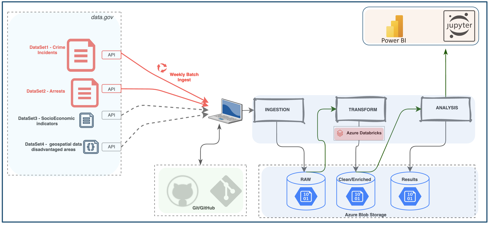

# 3. How to run the code :

### File structure:

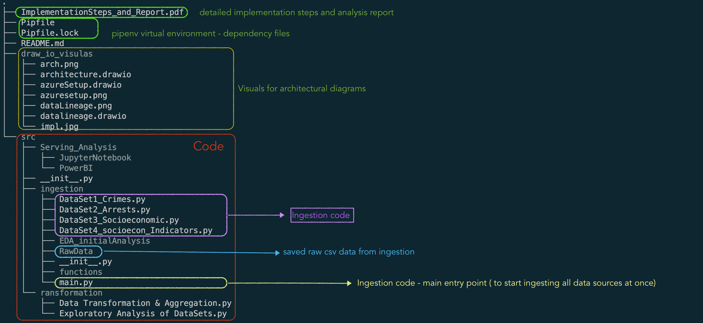

### step-1 : setup Local Machine Virtual Environment

A Pipenv virtual environment is set up on the local machine to run the ingestion code, with necessary Python packages installed to meet dependencies. The `Pipfile` or `Pipfile.lock` can be used to recreate the environment, and a table below shows some of the installed packages and their use cases.

**Install Pipenv**: Use the following command to install Pipenv:

```
pip install --user pipenv
```

**Activate Pipenv**:

```
  pipenv shell
```

**Pienv Documentation Link:**

- [pipenv documentation](https://pipenv.pypa.io/en/latest/)

---

### step-2 : Setup Azure Cloud

Within azure cloud a storage account, key vault and Azure data bricks workspace is created.

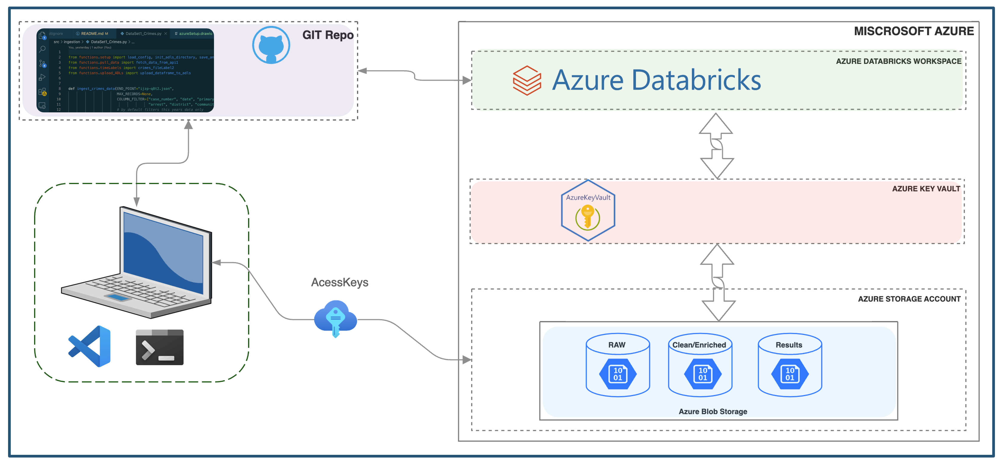

# 4. Implementation Steps (Road map)

The project follows the data engineering lifecycle, including ingestion, transformation, and analysis. To see detailed implementation steps, visit the [ImplementationSteps_and_Report.pdf](https://github.com/dfroslie-ndsu-org/f23-project-BeTKH/blob/main/ImplementationSteps_and_Report.pdf) file within this repo.

## I. INGESTION

Data is ingested programmatically from four sources (shown below) into Azure Blob Storage using batch approach. Containers within Azure storage are also programmatically created using `azure-storage-file-datalake` python package. Row/column filters are applied to ingest only relevant data, avoid null values and aovid API throtteling.

To start ingestion, register on `Data.gov` to create an API key and store it in a config file. Also copy SAS key to a config file to be able to write to azure storage programatically. Add config files to `.gitignore` for security.

### DataSource #1: Crimes - 2001 to Present - Dynamic data

| Attribute                 | Details                                                                                                                                                                                |
| ------------------------- | -------------------------------------------------------------------------------------------------------------------------------------------------------------------------------------- |
| **Dataset URL**           | [Crimes - 2001 to Present](https://catalog.data.gov/dataset/crimes-2001-to-present)                                                                                                    |
| **About Data**            | [`https://data.cityofchicago.org/Public-Safety/Crimes-2001-to-Present/ijzp-q8t2/about_data`](https://data.cityofchicago.org/Public-Safety/Crimes-2001-to-Present/ijzp-q8t2/about_data) |
| **API Endpoint**          | [`https://data.cityofchicago.org/resource/ijzp-q8t2.json`](https://data.cityofchicago.org/resource/ijzp-q8t2.json)                                                                     |
| **API Documentation**     | [`https://dev.socrata.com/foundry/data.cityofchicago.org/ijzp-q8t2`](https://dev.socrata.com/foundry/data.cityofchicago.org/ijzp-q8t2)                                                 |
| **Data Owner**            | Chicago Police Department                                                                                                                                                              |
| **Date Created**          | `September 30, 2011`                                                                                                                                                                   |
| **Data Update Frequency** | `Daily`                                                                                                                                                                                |
| **Rows**                  | `8.19M` (each row represents a reported crime, anonymized to the block level)                                                                                                          |
| **Columns**               | `22`                                                                                                                                                                                   |
| **DateRange**             | `01/01/2001` - `present`                                                                                                                                                               |

### DataSource #2: Arrests - Dynamic data

| Attribute                 | Details                                                                                                                                                  |
| ------------------------- | -------------------------------------------------------------------------------------------------------------------------------------------------------- |
| **Dataset URL**           | [Arrests](https://catalog.data.gov/dataset/arrests)                                                                                                      |
| **About Data**            | [`https://data.cityofchicago.org/Public-Safety/Arrests/dpt3-jri9/about_data`](https://data.cityofchicago.org/Public-Safety/Arrests/dpt3-jri9/about_data) |
| **API Endpoint**          | [`https://data.cityofchicago.org/resource/dpt3-jri9.json`](https://data.cityofchicago.org/resource/dpt3-jri9.json)                                       |
| **API Documentation**     | [`https://dev.socrata.com/foundry/data.cityofchicago.org/dpt3-jri9`](https://dev.socrata.com/foundry/data.cityofchicago.org/dpt3-jri9)                   |
| **Data Owner**            | Chicago Police Department                                                                                                                                |
| **Date Created**          | `June 22, 2020`                                                                                                                                          |
| **Data Update Frequency** | `Daily`                                                                                                                                                  |
| **Rows**                  | `660K` (each row represents an arrest, anonymized to the block level)                                                                                    |
| **Columns**               | `24`                                                                                                                                                     |
| **DateRange**             | `01/01/2014` - `present`                                                                                                                                 |

### DataSource #3: Socioeconomically Disadvantaged Areas

| Property                  | Details                                                                                                                                                                                                                                                |
| ------------------------- | ------------------------------------------------------------------------------------------------------------------------------------------------------------------------------------------------------------------------------------------------------ |
| **Dataset URL**           | [Socioeconomically Disadvantaged Areas](https://catalog.data.gov/dataset/socioeconomically-disadvantaged-areas)                                                                                                                                        |
| **About Data**            | [`https://data.cityofchicago.org/Community-Economic-Development/Socioeconomically-Disadvantaged-Areas/2ui7-wiq8/about_data`](https://data.cityofchicago.org/Community-Economic-Development/Socioeconomically-Disadvantaged-Areas/2ui7-wiq8/about_data) |
| **API Endpoint**          | [`https://data.cityofchicago.org/resource/2ui7-wiq8.geojson`](https://data.cityofchicago.org/resource/2ui7-wiq8.geojson)                                                                                                                               |
| **API Documentation**     | [`https://dev.socrata.com/foundry/data.cityofchicago.org/2ui7-wiq8`](https://dev.socrata.com/foundry/data.cityofchicago.org/2ui7-wiq8)                                                                                                                 |
| **Data Owner**            | Department of Planning and Development                                                                                                                                                                                                                 |
| **Date Created**          | `October 13, 2022`                                                                                                                                                                                                                                     |
| **Last Update**           | `July 12, 2024`                                                                                                                                                                                                                                        |
| **Data Update Frequency** | `N/A`                                                                                                                                                                                                                                                  |
| **Rows**                  | `254`                                                                                                                                                                                                                                                  |
| **Columns**               | `1`                                                                                                                                                                                                                                                    |

### DataSource #4: Socioeconomic Indicators

| Property                  | Details                                                                                                                                                                                                                                                        |
| ------------------------- | -------------------------------------------------------------------------------------------------------------------------------------------------------------------------------------------------------------------------------------------------------------- |
| **Dataset URL**           | [Census Data - Selected socioeconomic indicators](https://catalog.data.gov/dataset/census-data-selected-socioeconomic-indicators-in-chicago-2008-2012)                                                                                                         |
| **About Data**            | [`https://data.cityofchicago.org/Health-Human-Services/Census-Data-Selected-socioeconomic-indicators-in-C/kn9c-c2s2/about_data`](https://data.cityofchicago.org/Health-Human-Services/Census-Data-Selected-socioeconomic-indicators-in-C/kn9c-c2s2/about_data) |
| **API Endpoint**          | [`https://data.cityofchicago.org/resource/kn9c-c2s2.json`](https://data.cityofchicago.org/resource/kn9c-c2s2.json)                                                                                                                                             |
| **API Documentation**     | [`https://dev.socrata.com/foundry/data.cityofchicago.org/kn9c-c2s2`](https://dev.socrata.com/foundry/data.cityofchicago.org/kn9c-c2s2)                                                                                                                         |
| **Data Owner**            | Public Health                                                                                                                                                                                                                                                  |
| **Date Created**          | `January 5, 2012`                                                                                                                                                                                                                                              |
| **Last Update**           | `September 12, 2014`                                                                                                                                                                                                                                           |
| **Data Update Frequency** | `Updated as new data becomes available`                                                                                                                                                                                                                        |
| **Rows**                  | `78`                                                                                                                                                                                                                                                           |
| **Columns**               | `9`                                                                                                                                                                                                                                                            |

## II. TRANSFORMATION (Unify, Join, Aggregate data)

In the transformation phase, the data is unified, merged, and aggregated based on common attributes for analysis. Finally, the transformed data is analyzed in Power BI for dashboards and in Jupyter Notebook for visualizations, with the results stored back in Azure Blob Storage for serving.

### Data Lineage

Data Lineage as data goes through transformation steps.

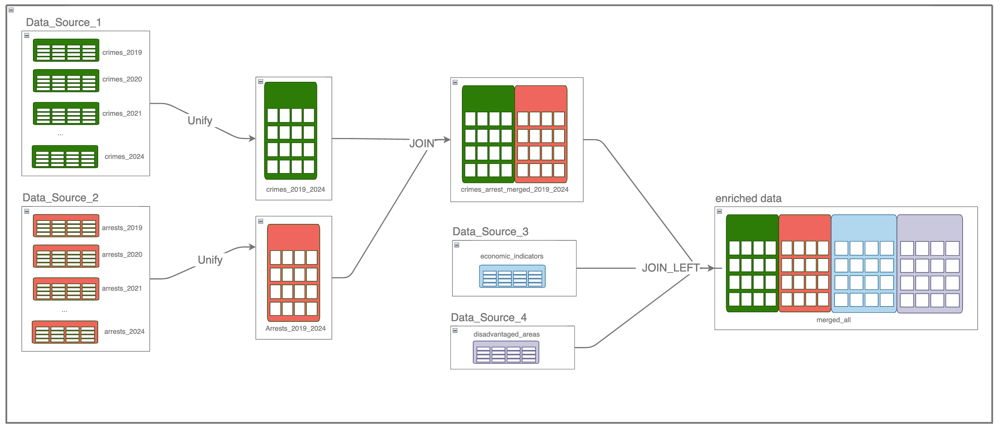

## III. SERVING/ANALYSIS

### Guiding Questions for Analysis

- What areas with high crime rates relative to socioeconomic factors?
- How crime trended over years, Months?
- Is crime more common towards weekends or workdays?
- What are High-risk districts that need more attention?
- Does poor socio economic indicators imply high crime rate?

### Visuals from Analysis via Power-BI

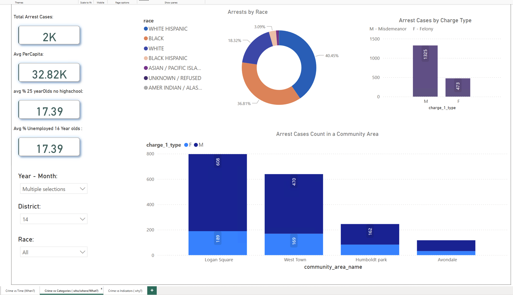

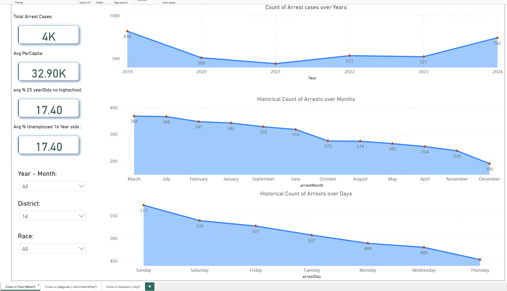

### Visuals from Analysis via Jupyter Notebook

[view Jupyter Notebook](https://github.com/dfroslie-ndsu-org/f23-project-BeTKH/blob/main/src/Serving_Analysis/JupyterNotebook/Crime_Analsysis_Chicago.ipynb)

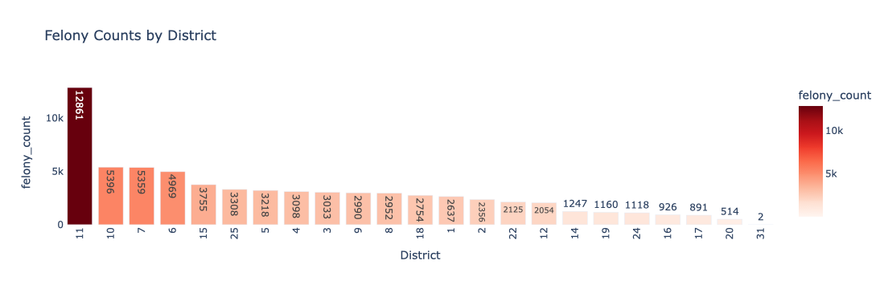
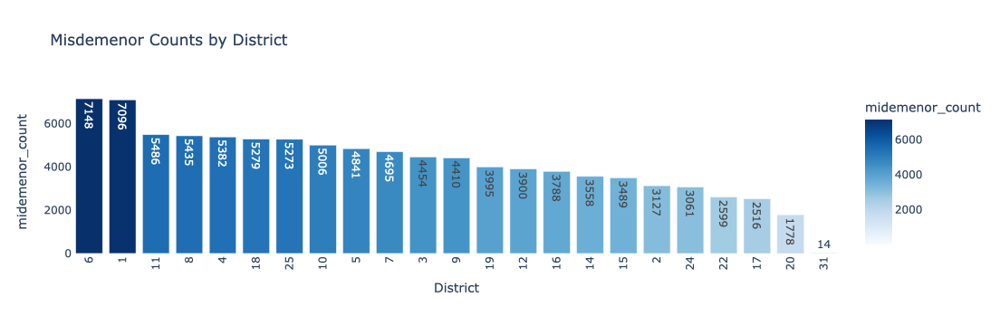
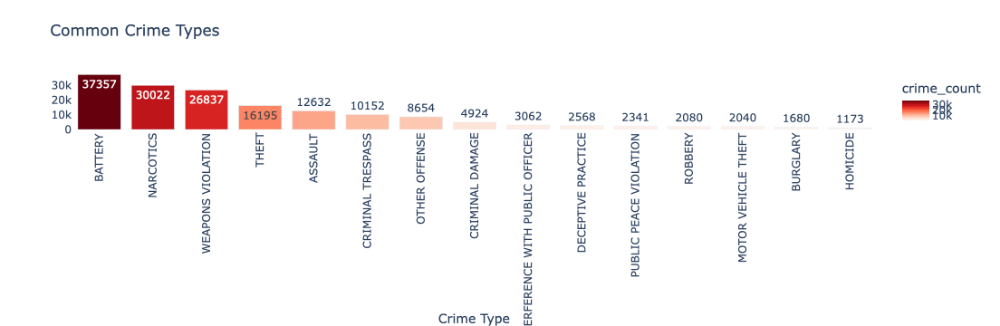
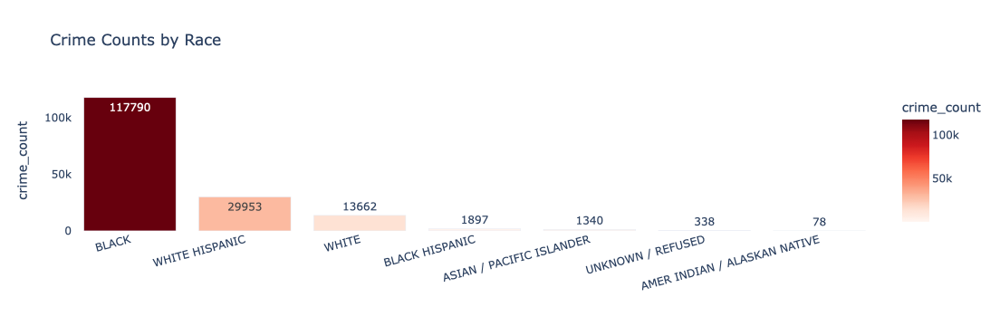
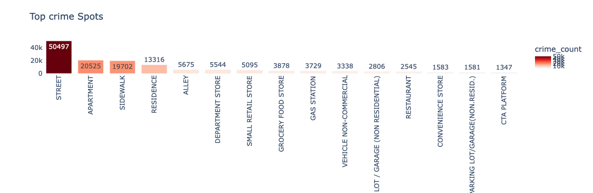
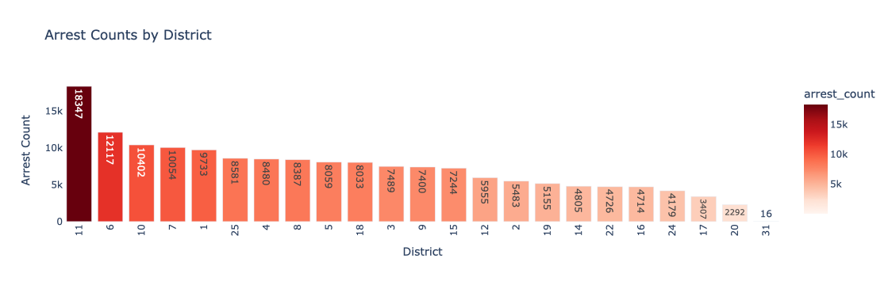

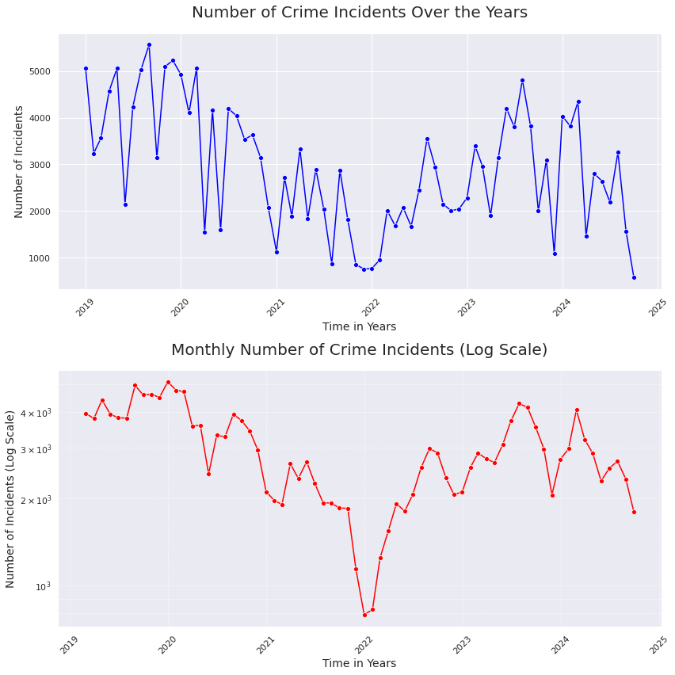

#### Socio-economic indicators vs disadvantaged areas in chicago


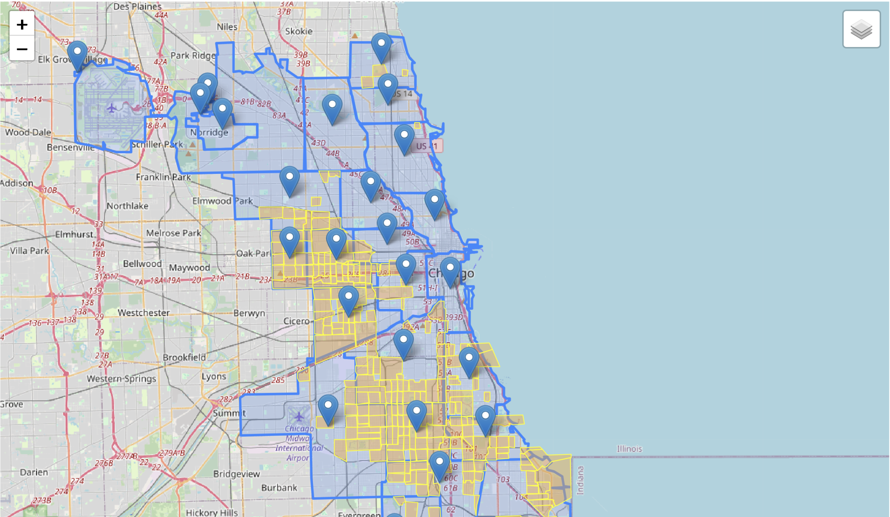

### Analysis Insights:

- Police District 11 in Chicago has highest rate of arrests.
- Most of the crime incidents happen on the street.
- Crime rates tend to rise towards weekend days of Friday, Saturday and Sunday.
- Crime rates seem higher towards march and April based on analysis of 5-year aggregated data.
- The most common crime types are Battery, narcotics, weapons violations and theft.
- Socio economic indicators seem to have a positive correlation with crime as socio-economically disadvantaged areas experience more crime.

### Call for Action based on Analysis Insights:

- Pay more attention or allocate resources for specific police districts such as District 11 or on weekends.
- To prevent most crime incidents that happen on the street, police must act.
- Pay attention to most common types of crimes such as Battery, narcotics, weapons violations and theft.
- Pay attention to Socio economically disadvantaged areas to increase Per-Capita income and education level to proactively reduce crime rates.

### Further objectives to improve the project

- Automate ingestion with automation tools like Azure data factory or Airflow.
- Automatic deployment of cloud using Infrastructure as a code (Terraform)
- Unit testing of code modules
